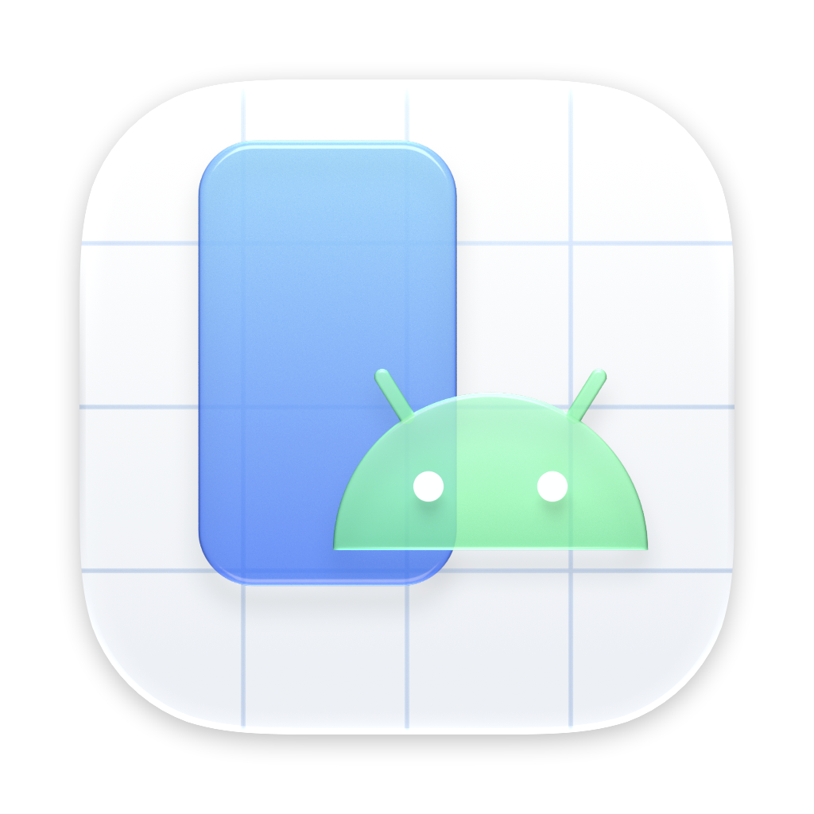
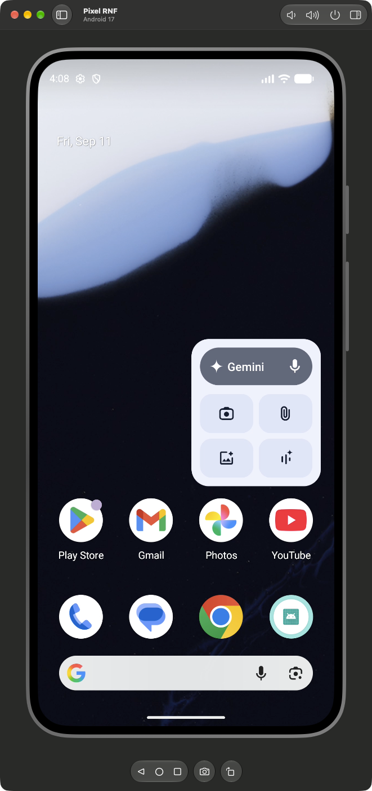

<div align="center">
  
  <h1>🤖 DroidHub</h1>
  <p>Android device hub for <strong>macOS</strong>, in the spirit of the Device Hub that ships with Xcode 27. Emulators and phones in one list, with the screen live and clickable inside a normal window.<br>
  <strong>Tiling friendly:</strong> there's no floating toolbar and no custom chrome, so yabai and friends tile it like any other app.<br>
  Written in Swift on top of the <a href="https://github.com/Genymobile/scrcpy">scrcpy</a> server.</p>

  [](https://github.com/eduardoborges/droidhub/releases)
  [](#requirements)
  [](Sources/DroidHub/)
  [](https://github.com/Genymobile/scrcpy)

</div>

---

**[Download](https://github.com/eduardoborges/droidhub/releases/latest)** · **[Changelog](CHANGELOG.md)**

<p align="center"></p>

## Why

The Android emulator draws its own frameless window with a toolbar floating beside it. A tiling window manager can't place that pair properly, and scrcpy's SDL window has no device list or controls. DroidHub boots emulators headless (`-no-window`) and draws the screen in a regular SwiftUI window instead.

## What it does

- 🪟 **A real window.** Sidebar, screen and inspector live in one window. yabai tiles it out of the box, with no rules to add.
- 📱 **Live screen with input.** The device streams H.264 over the scrcpy protocol and the Mac decodes it in hardware. Click and drag become touches, the trackpad scrolls, and a right click goes back.
- ⌨️ **Type on the device.** Text, arrows and delete go straight to Android. Accented characters travel through the device clipboard, because scrcpy can only inject what the device key map knows. Esc is Back and ⌘M opens the React Native dev menu.
- 📋 **Shared clipboard.** Copy something on the device and it lands on the Mac. ⌘V pastes the Mac clipboard into the device.
- 🚀 **Headless emulators.** Boot and shut down AVDs from the sidebar. The emulator's own window never shows up.

And the rest:

- Back, Home and Recents in a floating bar at the bottom, volume and power in the toolbar.
- ⌘S takes a screenshot, saves it to the Desktop and copies it to the clipboard, like Simulator does.
- ⌘→ rotates the device.
- The inspector switches dark mode, font size, show taps and layout bounds, and lists model, Android version, resolution and density.
- Physical devices connected through adb show up next to the emulators.
- Plays well with AI agents. They drive the device through `adb` while you watch in DroidHub, and Show Taps marks every tap they make.

## Keyboard

| Key | Action |
|---|---|
| ⌘S | Screenshot |
| ⌘→ | Rotate |
| ⇧⌘H | Home |
| Esc or right click | Back |
| ⌘M | Menu key (React Native dev menu) |
| ⌘C ⌘X ⌘A | Copy, cut and select all on the device |
| ⌘V | Paste the Mac clipboard |

## Requirements

- macOS 26+ (Liquid Glass UI)
- Android SDK with `platform-tools` and `emulator`, in `~/Library/Android/sdk` or wherever `ANDROID_HOME` points
- AVDs created in Android Studio, read from `~/.android/avd`
- To build from source: Xcode 26+

## 🛠 Build

Grab `DroidHub.dmg` from the [latest release](https://github.com/eduardoborges/droidhub/releases/latest), or build it yourself:

```sh
./build.sh
open build/DroidHub.app
```

`build.sh` downloads the matching scrcpy server into `.build/`, compiles a release build with SwiftPM, wraps it in `build/DroidHub.app` and signs it ad hoc. `./build.sh --dmg` also packages `build/DroidHub.dmg`. Set `SIGN_IDENTITY` to sign with a Developer ID, and the `NOTARY_*` variables to notarize, which is what CD does.

The tests cover H.264 parsing and the control message encoding:

```sh
swift test
```

## Releases

Commits follow [Conventional Commits](https://www.conventionalcommits.org). On every push to `main`, release-please keeps a release PR open with the next version and the changelog. Merging it tags the release, and CD attaches a signed, notarized `DroidHub.dmg` and `DroidHub.zip`.

## How it works

When you select a device, DroidHub pushes `scrcpy-server` to `/data/local/tmp`, opens an `adb forward` tunnel and starts the server with `app_process`. Two sockets come back. The video socket carries H.264 packets, which go into an `AVSampleBufferDisplayLayer`. The control socket carries touches, keys, text and clipboard in scrcpy's binary format, both ways.

The scrcpy version is pinned in `build.sh`. The protocol changes between releases and the server refuses a client from a different version, so bump both together.

## Repository layout

```
Sources/DroidHub/
  App.swift      SwiftUI window: sidebar, device frame, bottom bar, inspector, input
  Hub.swift      device discovery (adb, AVD files), boot, shutdown, screenshots
  Mirror.swift   scrcpy client: sockets, H.264 to CMSampleBuffer, control messages
Tests/           protocol tests
icon/            AppIcon.icon (Icon Composer) and icon.py, the Blender script that renders its layers
.github/         CI (pull requests), CR (release-please), CD (signed dmg)
build.sh         builds, signs and packages DroidHub.app
version.txt      current version, bumped by release-please
```
